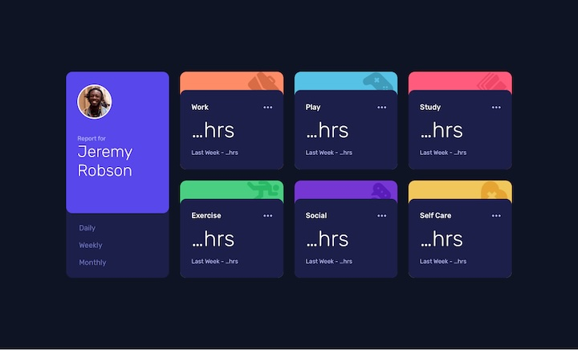
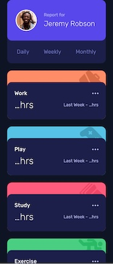

# Frontend Mentor - Time tracking dashboard solution

This is a solution to the [Time tracking dashboard challenge on Frontend Mentor](https://www.frontendmentor.io/challenges/time-tracking-dashboard-UIQ7167Jw). Frontend Mentor challenges help you improve your coding skills by building realistic projects. 

## Table of contents

- [Overview](#overview)
  - [The challenge](#the-challenge)
  - [Screenshot](#screenshot)
  - [Links](#links)
- [My process](#my-process)
  - [Built with](#built-with)
  - [What I learned](#what-i-learned)
  - [Continued development](#continued-development)
  - [Useful resources](#useful-resources)
- [Author](#author)
- [Acknowledgments](#acknowledgments)

## Overview

### The challenge

Users should be able to:

- View the optimal layout for the site depending on their device's screen size
- See hover states for all interactive elements on the page
- Switch between viewing Daily, Weekly, and Monthly stats

### Screenshot

### Links

- [Solution URL](https://github.com/kaaato/Time-tracking-dashboard-FM)
- [Live site URL](https://kaaato.github.io/Time-tracking-dashboard-FM/)

## My process

### Built with

- Semantic HTML5 markup
- CSS custom properties
- Flexbox
- CSS Grid
- Mobile-first workflow

### What I learned

 - My first approach was to have three buttons(Daily, Weekly and Monthly) with a panel that consists of six containers(Work, Play etc) and change each value when clicking the tab by JavaScript. I was reading a forum on Discord after my completion and realised there is a specific UI design for tabs. 
 - With that tabs pattern design, there should be three tabs and each tab has its own panel that contains six cards. The focus order for the tabs is different with specific keyboard features. 

### Continued development

 - I've never used the fetch method and json data. I need to see more use cases and projects like this one. 

### Useful resources

 - Tabs Pattern: [W3C](https://www.w3.org/WAI/ARIA/apg/patterns/tabs/)
 - Tabs: [Inclusive Components](https://inclusive-components.design/tabbed-interfaces/)
 - Cards: [Inclusive Components](https://inclusive-components.design/cards/)